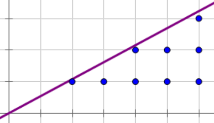
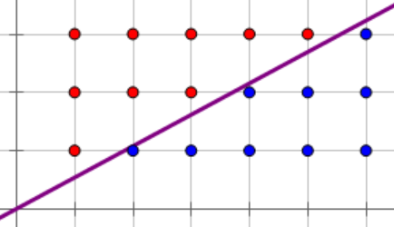

## 定义

一个数 $a$，如果不是 $p$ 的倍数且模 $p$ 同余于某个数的平方，则称 $a$ 为模 $p$ 的 **二次剩余**。而一个不是 $p$ 的倍数的数 $b$，不同余于任何数的平方，则称 $b$ 为模 $p$ 的 **二次非剩余**。

对二次剩余求解，也就是对常数 $a$ 解下面的这个方程：

$$
x^2 \equiv a \pmod p
$$

通俗一些，可以认为是求模意义下的 **开平方** 运算。对于更高次方的开方的简单讨论，可以参见离散对数一文。

这里只讨论 $\boldsymbol{p}$ **为奇素数** 的求解方法。后文可能在模 $p$ 显然的情况下简写成二次（非）剩余。

## Legendre 符号

$$
\left(\frac{a}{p}\right)=\begin{cases}
1,\,&p\nmid a \text{ and }a\text{ is a quadratic residue modulo }p\\
-1,\,&p\nmid a \text{ and }a\text{ is a quadratic non-residue modulo }p\\
0,\,&p\mid a
\end{cases}
$$

通过 Legendre 符号可以判断一个数 $a$ 是否为二次剩余，具体判断 $a$ 是否为模 $p$ 的二次剩余，需要通过 Euler 判别准则来实现。

下图为部分 Legendre 符号的值。

## Euler 判别准则

### 定义

对于奇素数 $p$ 和 $p\nmid a$ 有

$$
a^{(p-1)/2}\equiv \left(\frac{a}{p}\right)\equiv
\begin{cases}
1\pmod p,&\text{if }x^2\equiv a\pmod p\text{ is solvable}\\
-1\pmod p,&\text{otherwise}
\end{cases}
$$

### 证明

**引理**：令 $p$ 为素数和模 $p$ 意义下原根 $g$ 并令 $a\equiv g^k\pmod p$。那么 $x^2\equiv a\pmod p$ 有解当且仅当 $k$ 为偶数。

**引理的证明**：（充分性）假设 $x^2\equiv a\pmod p$ 有解为 $g^l$ 对于某个 $l$ 成立。那么 $(g^l)^2\equiv a\pmod p\implies g^{2l}\equiv a\pmod p$。因此 $k\equiv 2l\pmod{p-1}$（Fermat 小定理），而 $p-1$ 为偶数，所以 $k$ 为偶数。

（必要性）假设 $k$ 为偶数，那么

$$
x^2\equiv g^k\pmod p\iff x^2\equiv (g^{k/2})^2\pmod p
$$

而因为 $k$ 为偶数，所以 $k/2$ 为整数，因此 $x^2\equiv g^k\pmod p$ 有解为 $g^{k/2}$。

因为 $g$ 为模 $p$ 的原根，那么 $g$ 的阶为 $\varphi(p)=p-1$ 所以 $g^{p-1}\equiv 1\pmod p$ 且根据阶的定义，对于所有 $k\in\mathbb{Z}$ 满足 $1\leq k\lt p-1$ 都有 $g^k\not\equiv 1\pmod p$，所以

$$
\begin{aligned}
&{}g^{p-1}\equiv 1&\pmod p\\
\iff &g^{p-1}-1\equiv 0&\pmod p\\
\iff &\left(g^{(p-1)/2}-1\right)\cdot\left(g^{(p-1)/2}+1\right)\equiv 0&\pmod p\\
\implies &g^{(p-1)/2}\equiv -1&\pmod p
\end{aligned}
$$

考虑同余方程 $x^2\equiv a\pmod p$。因为 $a\in\mathbb{F}_p\setminus \lbrace 0\rbrace$ 且 $a\equiv g^k\pmod p$ 对于某个 $k$ 满足 $1\leq k\leq p-1$ 成立。若同余方程存在解，则 $k$ 为偶数，通过上述引理和 Fermat 小定理有

$$
\begin{aligned}
a^{(p-1)/2}&\equiv \left(g^k\right)^{(p-1)/2}&\pmod p\\
&\equiv \left(g^{p-1}\right)^{k/2}&\pmod p\\
&\equiv 1&\pmod p
\end{aligned}
$$

所以当 $a^{(p-1)/2}\equiv 1\pmod p$ 时解存在。

又因上述引理，$x^2\equiv a\pmod p$ 无解时 $k$ 为奇数。假设 $k$ 为奇数，那么

$$
\begin{aligned}
a^{(p-1)/2}&\equiv (g^k)^{(p-1)/2}&\pmod p\\
&\equiv \left(g^{(p-1)/2}\right)^k&\pmod p\\
&\equiv \left(-1\right)^k&\pmod p\\
&\equiv -1&\pmod p
\end{aligned}
$$

即得 Euler 判别准则，也可以推断出 Legendre 符号为完全积性函数。

## 二次剩余和二次非剩余的数量

### 定义

对于奇素数 $p$ 和集合 $\left\lbrace 1,2,\dots ,p-1\right\rbrace$，在模 $p$ 意义下二次剩余的数量等于二次非剩余的数量。

### 证明

**引理**：对于 $d\mid (p-1)$ 和奇素数 $p\in\mathbb{Z}$，$x^d\equiv 1\pmod p$ 恰有 $d$ 个解。

**引理的证明**：根据 Fermat 小定理，当 $\gcd(a,p)=1$ 时有 $a^{p-1}\equiv 1\pmod p$。因此对于每个 $a\in\left\lbrace 1,\dots ,p-1\right\rbrace$，$x=a$ 是 $x^{p-1}\equiv 1\pmod p$ 的解。通过因式分解 $x^{p-1}-1$ 有

$$
\begin{aligned}
x^{p-1}-1&\equiv (x^d-1)(x^{p-1-d}+x^{p-1-2d}+\cdots +1)&\pmod p\\
&\equiv (x^d-1)\cdot g(x)&\pmod p\\
&\equiv 0&\pmod p
\end{aligned}
$$

其中 $\deg(g(x))=p-1-d$。根据 [Lagrange 定理](./lagrange.md) 我们知道 $g(x)=0$ 最多有 $p-1-d$ 个解。因为 $x^{p-1}-1\equiv 0\pmod p$ 有 $p-1$ 个解，所以显然 $x^d-1\equiv 0\pmod p$ 至少有 $d$ 个解。如果只考虑 $x^d-1\equiv 0\pmod p$，我们知道最多有 $d$ 个解。所以 $x^d-1\equiv 0\pmod p$ 恰有 $d$ 个解。

根据 Euler 判别准则，对于 $a^{(p-1)/2}\equiv 1\pmod p$ 显然 $\frac{p-1}{2}\mid (p-1)$，又因上述引理所以 $a^{(p-1)/2}\equiv 1\pmod p$ 有 $\frac{p-1}{2}$ 个解，而集合中有 $p-1$ 个元素，所以也有 $\frac{p-1}{2}$ 个二次非剩余。

## 相关引理

二次剩余部分的重要引理有高斯引理和艾森斯坦引理。艾森斯坦是高斯的学生，两人的名字同时出现在域论、多项式理论和二次剩余部分中。

### 引理

在介绍高斯引理和艾森斯坦引理之前，先介绍一个引理，这个引理反复出现在高斯引理和艾森斯坦引理的证明中。

设 $p$ 为奇素数，$a$ 为不被 $p$ 整除的整数。设 $u_1,u_2,\cdots,u_s$ 为 $a,2a,\cdots,\frac{p-1}{2}a$ 模 $p$ 的最小正完全剩余系中大于 $\frac{p}{2}$ 的部分，$v_1,v_2,\cdots,v_t$ 为 $a,2a,\cdots,\frac{p-1}{2}a$ 模 $p$ 的最小正完全剩余系中小于 $\frac{p}{2}$ 的部分，则有 $\{v_1,v_2,\cdots,v_t,p-u_1,p-u_2,\cdots,p-u_s\}$ 恰好是 $\{1,2,\cdots,\frac{p-1}{2}\}$ 的一个排列。

不难举例解释这个引理。容易发现，$\{1,\cdots,\frac{p-1}{2}\}$ 中每个元素，在 $\{\frac{p+1}{2},\cdots,p-1\}$ 中都有自己的相反数，反之亦然。并且因为 $(a,p)=1$，所以 $(ja,p)=1,1\le j\le\frac{p-1}{2}$。

例如 $p=7,a=5$，那么 $\{1\times 5,2\times 5,3\times 5\}=\{5,10,15\}$ 的最小正完全剩余系为 $\{5,3,1\}$，其中大于 $\frac{7}{2}$ 的有 $1$ 个 $\{5\}$。于是集合 $\{v_1,v_2,\cdots,v_t\}$ 就是 $\{1,3\}$，集合 $\{u_1,u_2,\cdots,u_s\}$ 就是 $\{5\}$。

证明：

显然 $\{v_1,v_2,\cdots,v_t,p-u_1,p-u_2,\cdots,p-u_s\}$ 个数为 $\frac{p-1}{2}$，并且取值都在 $1$ 到 $\frac{p-1}{2}$，所以只需证明 $p-u_1,\cdots,p-u_s,v_1,\cdots,v_t$ 任意两个不同余。

首先，$p-u_i$ 两两不同余，$v_j$ 两两不同余。这是由于如果同余，那么必然有不相等的整数 $m,n$ 满足 $ma\equiv na\pmod{p}$，与之前的定义不符。

另外，也不存在 $i,j$ 使得 $p-u_i\equiv v_j$，因为这会导致存在不超过 $\frac{p-1}{2}$ 的整数 $m,n$ 使得 $-ma\equiv na\pmod{p}$，从而 $(m+n)a\equiv 0\pmod{p}$，而 $m+n<p$，与之前的定义也不符。证毕。

#### 推论

这个引理的推论是，这两个集合的求和与乘积应当完全相等。对于乘积有：

$$
(p-u_1)\cdots(p-u_s)v_1\cdots v_t\equiv \left(\frac{p-1}{2}\right)!\pmod{p}
$$

由乘积的结论给出了高斯引理。对于求和有：

$$
\sum_{j=1}^{\frac{p-1}{2}}j=\sum_{j=1}^s(p-u_j)+\sum_{j=1}^tv_j=ps-\sum_{j=1}^su_j+\sum_{j=1}^tv_j
$$

由乘积的结论给出了艾森斯坦引理。

### 高斯引理

高斯对二次互反律一共给出了六个证明。由于可以引出判断 $2$ 是否为模奇素数的二次剩余的重要结论，从高斯引理引出的第三个证明是今天讲解二次互反律的普遍办法。

设 $p$ 为奇素数，$a$ 为不被 $p$ 整除的整数。设 $s$ 为 $\{a,2a,\cdots,((p-1)/2)a\}$ 模 $p$ 的最小正完全剩余系中大于 $\frac{p}{2}$ 的数的个数，则有 $\left(\frac{a}{p}\right)={(-1)}^s$。

证明：

根据上述引理乘积的结论，有：

$$
(-1)^sv_1v_2\cdots v_tu_1u_2\cdots u_s\equiv\left(\frac{p-1}{2}\right)!\pmod{p}
$$

根据定义 $v_1v_2\cdots v_tu_1u_2\cdots u_s\equiv a^{\frac{p-1}{2}}\left(\frac{p-1}{2}\right)!\pmod{p}$，所以有：

$$
(-1)^sa^{\frac{p-1}{2}}\left(\frac{p-1}{2}\right)!\equiv \left(\frac{p-1}{2}\right)!\pmod{p}
$$

因为 $(p,\left(\frac{p-1}{2}\right)!)=1$，所以有 $(-1)^sa^{\frac{p-1}{2}}\equiv 1\pmod{p}$，即 $a^{\frac{p-1}{2}}\equiv (-1)^s\pmod{p}$。根据欧拉判别法，证毕。

#### 2 与二次剩余

高斯引理的直接推论是，模为奇素数 $p$ 时，判断 $2$ 是否为模 $p$ 的二次剩余。

根据高斯引理，设 $s$ 为 $\{2,4,\cdots,p-1\}$ 模 $p$ 的最小正完全剩余系中大于 $\frac{p}{2}$ 的数的个数，有结论：

$$
\left(\frac{2}{p}\right)\equiv {(-1)}^{s}\pmod{p}
$$

因此，当且仅当 $p$ 为 $8k+1$ 型或 $8k+7$ 型奇素数时，$2$ 是模 $p$ 的二次剩余。当且仅当 $p$ 为 $8k+3$ 型或 $8k+5$ 型奇素数时，$2$ 是模 $p$ 的二次非剩余。在形式上也可以记为：

$$
\left(\frac{2}{p}\right)\equiv {(-1)}^{\frac{p^2-1}{8}}\pmod{p}
$$

注：另一种证明二次互反律的办法借助高斯和（Gauss sum）。该办法较为抽象，然而在证明二次剩余在 $2$ 的情形时却显得非常简洁。记 $8$ 次本原单位根 $w_8=\frac{1+\mathrm{i}}{\sqrt{2}}$，则有：

$$
\begin{aligned}
\left(\frac{2}{p}\right)&\equiv 2^{\frac{p-1}{2}}\\
&=\frac{1}{\sqrt{2}}{\left(w_8+w_8^{-1}\right)}^p\\
&=\frac{1}{\sqrt{2}}\left(w_8^p+w_8^{-p}+\right)+C_p^1\frac{1}{\sqrt{2}}\left(w_8^{p-2}+w_8^{2-p}+\right)+\cdots\\
&\equiv\frac{1}{\sqrt{2}}(w_8^p+w_8^{-p})\\
&=\begin{cases}
1\pmod p,&p\equiv 1,7\pmod 8\\
-1\pmod p,&p\equiv 3,5\pmod 8
\end{cases}
\end{aligned}
$$

中间的同余式是因为二项式展开后进行首位配对，后面每一项都是整数，而前面的二项式系数均被 $p$ 整除。

### 艾森斯坦引理

艾森斯坦对高斯的第三个证明进行了改进，运用了几何直观的办法进行格点计数。

设 $p$ 是奇素数，$a$ 是不被 $p$ 整除的奇数。记 $T(a,p)=\sum_{j=1}^{\frac{p-1}{2}}\left\lfloor\frac{ja}{p}\right\rfloor$，则有 $\left(\frac{a}{p}\right)=(-1)^{T(a,p)}$。

证明：

根据上述引理求和的结论，有：

$$
\sum_{j=1}^{\frac{p-1}{2}}j=ps-\sum_{j=1}^su_j+\sum_{j=1}^tv_j
$$

又注意到：

$$
\sum_{j=1}^{\frac{p-1}{2}}ja=\sum_{j=1}^{\frac{p-1}{2}}p\left\lfloor\frac{ja}{p}\right\rfloor+\sum_{j=1}^{\frac{p-1}{2}}(ja\bmod{p})=\sum_{j=1}^{\frac{p-1}{2}}p\left\lfloor\frac{ja}{p}\right\rfloor+\sum_{j=1}^s u_j+\sum_{j=1}^t v_j
$$

两式相减，得到：

$$
(a-1)\sum_{j=1}^{\frac{p-1}{2}}j=pT(a,p)-ps+2\sum_{j=1}^s u_j
$$

两边同时对 $2$ 取模，可得：

$$
0\equiv T(a,p)-s\pmod{2}
$$

从而 $\left(\frac{a}{p}\right)=(-1)^s=(-1)^{T(a,p)}$。证毕。

#### 几何意义

艾森斯坦引理具有几何意义。

设直线 $y=\frac{ax}{p}$，那么和式 $T(a,p)=\sum^{\frac{p-1}{2}}_{j=1}\left\lfloor\frac{ja}{p}\right\rfloor$ 表示区域 $1\le x\le \frac{p-1}{2},1\le y\le \frac{ax}{p}$ 的整点的个数。

于是 $T(q,p)$ 描述了 $1\le x\le \frac{p-1}{2},1\le y\le \frac{qx}{p}$ 的区域内整点的个数。如果沿着对角线对称，$T(p,q)$ 描述了 $1\le y\le \frac{q-1}{2},1\le x\le \frac{py}{q}$ 的区域内整点的个数。

例如 $a=7,p=13$ 时，描述的就是 $1\le x\le 6,1\le y\le \frac{7x}{13}$ 里面的整点数。

对于两个奇素数 $q,p,q\ne p$，应当有 $qx\ne py$，否则 $q|py$，而 $q\not|y,q\not|p$，矛盾。所以这条直线在 $1\le x\le \frac{p-1}{2},1\le y\le \frac{q-1}{2}$ 的范围内不会经过整点。

在范围 $1\le x\le \frac{p-1}{2},1\le y\le \frac{q-1}{2}$ 内的整点 $(x,y)$ 个数是 $\frac{p-1}{2}\frac{q-1}{2}$，故得出 $T(p,q)+T(q,p)=\frac{p-1}{2}\frac{q-1}{2}$。

例如下图，$q=7,p=13$:

## 二次互反律

设 $p,q$ 为两个不相等的奇素数，则有：

$$
\left(\frac{p}{q}\right)\left(\frac{q}{p}\right)=(-1)^{\frac{p-1}{2}\frac{q-1}{2}}
$$

证明：

由艾森斯坦引理可知：

$$
\left(\frac{q}{p}\right)\left(\frac{p}{q}\right)=(-1)^{T(q,p)+T(p,q)}
$$

根据上述几何意义 $\frac{p-1}{2}\frac{q-1}{2}=T(p,q)+T(q,p)$，有：

$$
(-1)^{\frac{p-1}{2}\frac{q-1}{2}}=(-1)^{T(p,q)}(-1)^{T(q,p)}\equiv \left(\frac{p}{q}\right)\left(\frac{q}{p}\right)
$$

证毕。

## 特殊情况时的算法

对于同余方程 $x^2\equiv a\pmod p$，其中 $p$ 为奇素数且 $a$ 为二次剩余在 $p\bmod 4=3$ 时有更简单的解法，考虑

$$
\begin{aligned}
\left(a^{(p+1)/4}\right)^2&\equiv a^{(p+1)/2}&\pmod p\\
&\equiv x^{p+1}&\pmod p\\
&\equiv \left(x^2\right)\left(x^{p-1}\right)&\pmod p\\
&\equiv x^2&\pmod p&\quad (\because{\text{Fermat's little theorem}})
\end{aligned}
$$

那么 $a^{(p+1)/4}\bmod p$ 为一个解。

### Atkin 算法

#### 过程

仍然考虑上述同余方程，此时 $p\bmod 8=5$，那么令 $b\equiv (2a)^{(p-5)/8}\pmod p$ 和 $\mathrm{i}\equiv 2ab^2\pmod p$ 那么此时 $\mathrm{i}^2\equiv -1\pmod p$ 且 $ab(\mathrm{i}-1)\bmod p$ 为一个解。

#### 证明

$$
\begin{aligned}
\mathrm{i}^2&\equiv\left(2ab^2\right)^2&\pmod p\\
&\equiv \left(2a\cdot \left(2a\right)^{(p-5)/4}\right)^2&\pmod p\\
&\equiv \left(\left(2a\right)^{(p-1)/4}\right)^2&\pmod p\\
&\equiv \left(2a\right)^{(p-1)/2}&\pmod p\\
&\equiv -1&\pmod p
\end{aligned}
$$

其中 $2$ 在模形如 $8k+3$ 或 $8k+5$ 的素数时为二次非剩余，这由二次互反律给出，由于证明较复杂，读者可参考 [Wikipedia](https://en.wikipedia.org/wiki/Quadratic_reciprocity)。

那么

$$
\begin{aligned}
\left(ab(\mathrm{i}-1)\right)^2&\equiv a^2\cdot \left(2a\right)^{(p-5)/4}\cdot (-2\mathrm{i})&\pmod p\\
&\equiv a\cdot (-\mathrm{i})\cdot \left(2a\right)^{(p-1)/4}&\pmod p\\
&\equiv a&\pmod p
\end{aligned}
$$

得证。

## Cipolla 算法

### 定义

Cipolla 算法用于求解同余方程 $x^2\equiv a\pmod p$，其中 $p$ 为奇素数且 $a$ 为二次剩余。

### 过程

算法可描述为找到 $r$ 满足 $r^2-a$ 为二次非剩余，$(r-x)^{(p+1)/2}\bmod (x^2-(r^2-a))$ 为一个解。

在复数域 $\mathbb{C}$ 中，记 $\mathrm{i}^2=-1$ 后 $\mathbb{C}=\lbrace a_0+a_1\mathrm{i}\mid a_0,a_1\in\mathbb{R}\rbrace$。考虑令 $x^2+1\in\mathbb{R}\lbrack x\rbrack$ 和实系数多项式的集合 $\mathbb{R}\lbrack x\rbrack$ 对 $x^2+1$ 取模后的集合记作 $\mathbb{R}\lbrack x\rbrack /(x^2+1)$，那么集合中的元素都可以表示为 $a_0+a_1x$ 的形式，其中 $a_0,a_1\in\mathbb{R}$，又因为 $x^2\equiv -1\pmod{\left(x^2+1\right)}$，考虑多项式的运算可以发现 $\mathbb{R}\lbrack x\rbrack /(x^2+1)$ 中元素的运算与 $\mathbb{C}$ 中一致。

后文考虑对于系数属于有限域 $\mathbb{F}_p$ 的多项式 $\mathbb{F}_p\lbrack x\rbrack$ 和对 $x^2-(r^2-a)\in\mathbb{F}_p\lbrack x\rbrack$ 取模后的集合 $\mathbb{F}_p\lbrack x\rbrack /(x^2-(r^2-a))$ 中的运算。

**选择**  $r$：

若 $a\equiv 0\pmod p$ 那么 $r^2-a$ 为二次剩余，此时解显然为 $x\equiv 0\pmod p$。所以假设 $a\not\equiv 0\pmod p$。使得 $r^2-a$ 为非零二次剩余的选择有 $(p-3)/2$ 个，而使得 $r^2\equiv a\pmod p$ 的选择恰有两个，那么有 $(p-1)/2$ 种选择可以使得 $r^2-a$ 为二次非剩余，使用随机方法平均约两次可得 $r$。

### 证明

令 $f(x)=x^2-(r^2-a)\in\mathbb{F}_p\lbrack x\rbrack$ 和 $a_0+a_1x=(r-x)^{(p+1)/2}\bmod (x^2-(r^2-a))$ 那么有 $a_0^2\equiv a\pmod p$ 且 $a_1\equiv 0\pmod p$。

$$
\begin{aligned}
x^p&\equiv x(x^2)^{(p-1)/2}&\pmod{f(x)}\\
&\equiv x(r^2-a)^{(p-1)/2}&\pmod{f(x)}&\quad (\because{x^2\equiv r^2-a\pmod{f(x)}})\\
&\equiv -x&\pmod{f(x)}&\quad (\because{r^2-a}\text{ is quadratic non-residue})
\end{aligned}
$$

又因为二项式定理

$$
\begin{aligned}
(a+b)^p&=\sum_{i=0}^p\binom{p}{i}a^ib^{p-i}\\
&=\sum_{i=0}^p\frac{p!}{i!(p-i)!}a^ib^{p-i}\\
&\equiv a^p+b^p\pmod p
\end{aligned}
$$

可以发现只有当 $i=0$ 和 $i=p$ 时由于没有因子 $p$ 不会因为模 $p$ 被消去，其他的项都因为有 $p$ 因子被消去了。所以

$$
\begin{aligned}
(r-x)^{p}&\equiv r^p-x^p&\pmod{f(x)}\\
&\equiv r+x&\pmod{f(x)}
\end{aligned}
$$

所以

$$
\begin{aligned}
(a_0+a_1x)^2&=a_0^2+2a_0a_1x+a_1^2x^2\\
&\equiv (r-x)^{p+1}&\pmod{f(x)}\\
&\equiv (r-x)^p(r-x)&\pmod{f(x)}\\
&\equiv (r+x)(r-x)&\pmod{f(x)}\\
&\equiv r^2-x^2&\pmod{f(x)}\\
&\equiv a&\pmod{f(x)}
\end{aligned}
$$

若 $a_1\not\equiv 0\pmod p$ 且

$$
\begin{aligned}
(a_0+a_1x)^2&=a_0^2+2a_0a_1x+a_1^2x^2\\
&\equiv a_0^2+2a_0a_1x+a_1^2(r^2-a)\pmod{f(x)}
\end{aligned}
$$

所以 $x$ 的系数必须为零即 $a_0\equiv 0\pmod p$ 此时考虑 Legendre 符号为完全积性函数可知 $r^2-a\equiv a/a_1^2\pmod p$ 显然为二次剩余，不符合定义。因此 $a_1\equiv 0\pmod p$ 且 $a_0^2\equiv a\pmod p$。

## Bostan–Mori 算法

该算法基于 Cipolla 算法，我们将问题转换为 [常系数齐次线性递推](../linear-recurrence.md) 再应用 Bostan–Mori 算法。考虑另一种常见的 Cipolla 算法的描述为 $b=x^{\left(p+1\right)/2}\bmod{\left(x^2-tx+a\right)}$ 为满足 $b^2\equiv a\pmod{p}$ 的一个解[^ref3]，其中 $x^2-tx+a\in \mathbb{F}_p\lbrack x\rbrack$ 为不可约多项式。选取 $t$ 同样使用随机。证明过程略。参考文献[^ref4]中的算法我们可以发现问题可转化为求解形式幂级数的乘法逆元的某一项系数：

$$
b=\left\lbrack x^{(p+1)/2}\right\rbrack\dfrac{1}{1-tx+ax^2}
$$

且

$$
\left\lbrack x^n\right\rbrack\dfrac{k_0+k_1x}{1+k_2x+k_3x^2}=
\begin{cases}
\left\lbrack x^{(n-1)/2}\right\rbrack\dfrac{k_1-k_0k_2+k_1k_3x}{1+(2k_3-k_2^2)x+k_3^2x^2},&\text{if }n\bmod 2=1\\
\left\lbrack x^{n/2}\right\rbrack\dfrac{k_0+(k_0k_3-k_1k_2)x}{1+(2k_3-k_2^2)x+k_3^2x^2},&\text{else if }n\neq 0
\end{cases}
$$

而 $n=0$ 时显然有 $\left\lbrack x^0\right\rbrack\dfrac{k_0+k_1x}{1+k_2x+k_3x^2}=k_0$，该算法乘法次数相较于 Cipolla 算法更少，其他相关乘法次数较少的算法可见[^ref2]。

## Legendre 算法

### 定义

对于同余方程 $x^2\equiv a\pmod p$，其中 $p$ 为奇素数且 $a$ 为二次剩余。Legendre 算法可描述为找到 $r$ 满足 $r^2-a$ 为二次非剩余，令 $a_0+a_1x=(r-x)^{(p-1)/2}\bmod (x^2-a)$，那么 $a_0\equiv 0\pmod p$ 且 $a_1^{-2}\equiv a\pmod p$。

### 证明

考虑选择一个 $b$ 满足 $b^2\equiv a\pmod p$，那么 $(r-b)(r+b)=r^2-a$ 为二次非剩余，所以

$$
(r-b)^{(p-1)/2}(r+b)^{(p-1)/2}\equiv -1\pmod p
$$

存在环态射

$$
\begin{aligned}
\phi:\mathbb{F}_p\lbrack x\rbrack/(x^2-a)&\to \mathbb{F}_p\times \mathbb{F}_p\\
x&\mapsto (b,-b)
\end{aligned}
$$

那么

$$
\begin{aligned}
(a_0+a_1b,a_0-a_1b)&=\phi(a_0+a_1x)\\
&=\phi(r-x)^{(p-1)/2}\\
&=((r-b)^{(p-1)/2},(r+b)^{(p-1)/2})\\
&=(\pm 1,\mp 1)
\end{aligned}
$$

所以 $2a_0=(\pm 1)+(\mp 1)=0$ 而 $2a_1b=(\pm 1)-(\mp 1)=\pm 2$。

## Tonelli–Shanks 算法

### 定义

Tonelli–Shanks 算法是基于离散对数求解同余方程 $x^2\equiv a\pmod p$ 的算法[^ref1]，其中 $p$ 为奇素数且 $a$ 为模 $p$ 的二次剩余。

令 $p-1=2^n\cdot m$ 其中 $m$ 为奇数。仍然使用随机方法寻找 $r\in\mathbb{F}_p$ 满足 $r$ 为二次非剩余。令 $g\equiv r^m\pmod p$ 且 $b\equiv a^{(m-1)/2}\pmod p$，那么存在整数 $e\in\lbrace 0,1,2,\dots ,2^n-1\rbrace$ 满足 $ab^2\equiv g^e\pmod p$。若 $a$ 为二次剩余，那么 $e$ 为偶数且 $\left(abg^{-e/2}\right)^2\equiv a\pmod p$。

### 证明

$$
\begin{aligned}
g^{2^n}&\equiv r^{2^n\cdot m}&\pmod p\\
&\equiv r^{p-1}&\pmod p\\
&\equiv 1&\pmod p
\end{aligned}
$$

而

$$
\begin{aligned}
g^{2^{n-1}}&\equiv r^{2^{n-1}\cdot m}&\pmod p\\
&\equiv r^{(p-1)/2}&\pmod p\\
&\equiv -1&\pmod p
\end{aligned}
$$

所以 $g$ 的阶为 $2^n$，又因为 $ab^2\equiv a^m\pmod p$ 是 $x^{2^n}\equiv 1\pmod p$ 的解，所以 $a^m$ 是 $g$ 的幂次，记 $a^m\equiv g^e\pmod p$。

若 $a$ 是二次剩余，那么

$$
\begin{aligned}
g^{2^{n-1}\cdot e}&\equiv (-1)^e&\pmod p\\
&\equiv a^{2^{n-1}\cdot m}&\pmod p\\
&\equiv a^{(p-1)/2}&\pmod p\\
&\equiv 1&\pmod p
\end{aligned}
$$

所以 $e$ 为偶数，而

$$
\begin{aligned}
\left(abg^{-e/2}\right)^2&\equiv a^2b^2g^{-e}&\pmod p\\
&\equiv a^{m+1}g^{-e}&\pmod p\\
&\equiv a&\pmod p
\end{aligned}
$$

剩下的问题是如何计算 $e$，Tonelli 和 Shanks 提出一次确定 $e$ 的一个比特。令 $e$ 在二进制下表示为 $e=e_0+2e_1+4e_2+\cdots$ 其中 $e_k\in\lbrace 0,1\rbrace$。

因为 $a$ 是二次剩余，所以开始时 $e_0=0$，然后计算 $e_1$ 然后 $e_2$ 等等，由以下公式给出

$$
\left(g^eg^{-(e\bmod 2^k)}\right)^{2^{n-1-k}}\equiv g^{2^{n-1}\cdot e_k}\equiv 
\begin{cases}
1\pmod p,&\text{if }e_k=0\\
-1\pmod p,&\text{else if }e_k=1
\end{cases}
$$

正确性显然。

## 习题

[【模板】二次剩余](https://www.luogu.com.cn/problem/P5491)

[「Timus 1132」Square Root](https://acm.timus.ru/problem.aspx?space=1&num=1132)

## 外部链接

- <https://en.wikipedia.org/wiki/Quadratic_residue>
- <https://en.wikipedia.org/wiki/Euler%27s_criterion>

## 参考文献

[^ref1]: Daniel. J. Bernstein. Faster Square Roots in Annoying Finite Fields.

[^ref2]: S. Müller, On the computation of square roots in finite fields, Design, Codes and Cryptography, Vol.31, pp. 301-312, 2004

[^ref3]: A. Menezes, P. van Oorschot and S. Vanstone. Handbook of Applied Cryptography, 1996.

[^ref4]: Alin Bostan, Ryuhei Mori.[A Simple and Fast Algorithm for Computing the N-th Term of a Linearly Recurrent Sequence](https://arxiv.org/abs/2008.08822).
